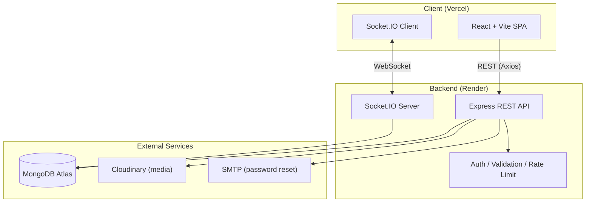
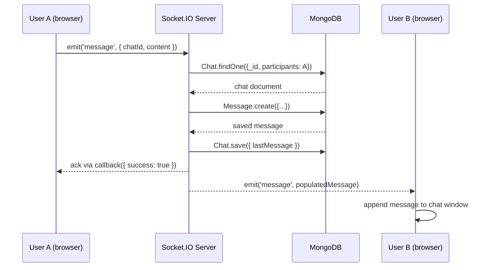
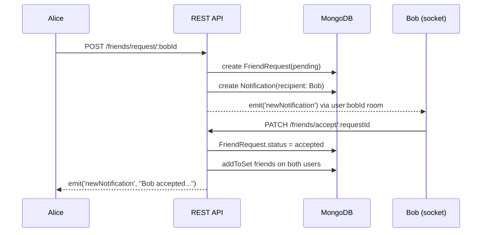
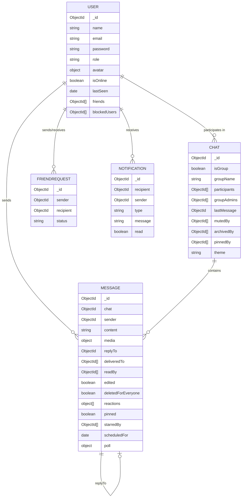

# Architecture & Deployment

## Architecture Diagram



## Sequence Diagram — Sending a Message



## Sequence Diagram — Friend Request



## ER Diagram



## Deployment Guide

### 1. Database — MongoDB Atlas
1. Create a free cluster at https://cloud.mongodb.com
2. Add a database user and allow network access from `0.0.0.0/0` (or Render's IPs)
3. Copy the connection string for use as `MONGO_URI`

### 2. Backend — Render
1. Push this repo to GitHub
2. On https://render.com, create a **New Web Service** pointing at the `server/` directory
   - Build command: `npm install`
   - Start command: `npm start`
3. Add environment variables from `server/.env.example` in Render's dashboard
   (`MONGO_URI`, `JWT_SECRET`, `JWT_REFRESH_SECRET`, `CLOUDINARY_*`, `SMTP_*`, and
   set `CLIENT_URL` to your Vercel frontend URL once deployed)
4. Deploy — Render gives you a URL like `https://messenger-app-api.onrender.com`

### 3. Frontend — Vercel
1. On https://vercel.com, import the repo, set the root directory to `client/`
2. Framework preset: Vite
3. Add an environment variable `VITE_API_URL` pointing to your Render backend URL
4. Deploy — Vercel gives you a URL like `https://messenger-app.vercel.app`

### 4. Final step
Go back to Render and update `CLIENT_URL` to your actual Vercel URL (needed for
CORS and cookie settings), then redeploy the backend.

### Local development (Docker Compose alternative)
```bash
docker compose up --build
```
This runs MongoDB + the backend together locally using `docker-compose.yml`
and `server/Dockerfile`. Run the frontend separately with `npm run dev` inside `client/`.
